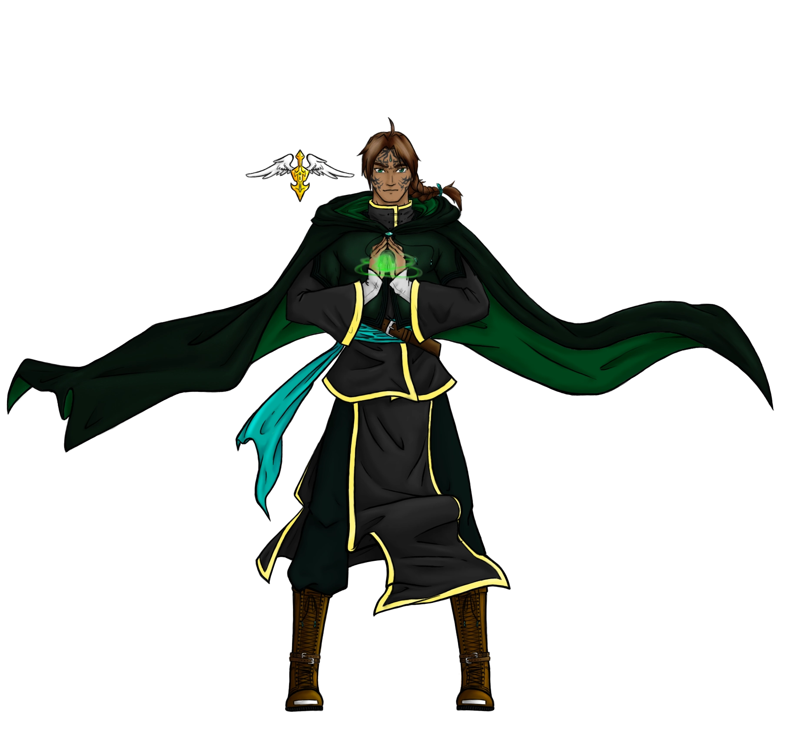

In this section of the website, you will learn why I use the name Mala Zedik and how it came into existence. 

## Mala Zedik
Mala Zedik is an online persona that I created that ended up representing myself in the virtual world. The visual concept and ideas for Mala are all mine; my friend [Aerpenium](https://www.deviantart.com/aerpenium) did all the artwork for Mala Zedik. They did an amazing job creating what I had envisioned for Mala Zedik and brought him to visual life!

When first creating Mala Zedik, I wasn't intending to use him as my online persona. He was intended to be an original character of mine to create content with. Over the years of creating and developing story a for Mala Zedik, did it seem reasonable to then use the name as my own. Shortly after Aerpenium created the first Mala Zedik image for me, I started to use Mala Zedik as my online identity.

### Origin Story
I first thought of Mala Zedik in my college years in 2010. Mala is short for Malachite, which should help explain all the green for Mala. Zedik was derived from Zeddicus Zu'l Zorander, my favorite spell caster from the Sword of Truth series by Terry Goodkind. So, you could say that Mala Zedik means "Green Mage".

After creating the name for Mala Zedik, I created the background for him. Born in a town called Nesha, raised by two loving parents; Shurma and Von. (Shurma is a variant of [Shirma](https://finalfantasy.fandom.com/wiki/Shirma) from Chocobo's Dungeon, one of my favorite games!)

The town of Nesha and the setting is heavily inspired by "From the New World" [Shinsekai Yori] by Yusuke Kishi. If you haven't seen the anime or read the novel, I strongly encourage it. In short, humans developed magic but the world wasn't prepared for everyone to have it. The world fell into ruins. Very much a dark fantasy and dystopian setting.

I do have a lot more I can share about the setting, ideas, and concepts, however, I do not wish to go into great detail about them. This is because I might make use of the information in a different setting, so to avoid spoilers in a sense I will not share. Overall though, the general story and concepts are heavily inspired by Shinsekai Yori and The Giver. 

## Other Online Names
Shurma Raha (female) and Mala Zedik (male) are the two most common names that I use online. However, there are a few other names that I use from time to time. Generally speaking, I will use Zedik as a surname most of the time, but in some instances, Raha may be used. Below is the list of First Names and Surnames that I tend to use in my personal weighted order. Zedik will tend to be used when a character is given only a single name in a game. However, some online games see ze'dik' and prevent me from using the name. (RIP) 

First Names
1) Mala 
2) Veyeiko
3) Shurma
4) Zedik 
5) Fionna
6) Von / Vongola

Surnames
1) Zedik
2) Raha

## Pre-Mala Zedik Era
Before Mala Zedik, I had many different names I would go by depending on what I was playing. I used Vongola (from Hitman Reborn) for a long while. However, after that series started to become popular, the name became harder and harder to use, so I needed a change. I used Chobi (from Final Fantasy Unlimited) for a while, but once again became a popular name as the internet grew and was hard to always obtain as a name.

After some time, I created "ExpsGaming" (which I semi-regret using 'Gaming' in the name). ExpsGaming was intended as short-hand "Experience Gaming" and I was intending to use this handle as my online identity. After some time and learning the hoops of the internet, I gave up on the name and went to Mala Zedik. Mostly due to having "gaming" in your name was greatly frowned upon. Just like having YT or TTV in your name...

To this day, I still own ExpsGaming.com and make use of the IP; however, it will no longer be my main identity for myself. If you happen to come across ExpsGaming online somewhere, there is a chance it is related to me in some way. 

## MalaZedik.com
Ultimately I created this website to build my online identity and rapport. I feel that the internet has reached a point where people need a consistent online identity to be taken seriously or have to have any weight to what they say. So, I created this website so that the internet can see me for who I am. 

Most people take to Facebook, Twitter, or other online social platforms, however, I do not wish to be limited to them. It's for that reason I created my website, so people can find me with a google search. 

Additionally, I was raised by a military family, so it was taboo to provide personal information over the internet. When Facebook and Myspace came about, I legitimately thought they would fail because people wouldn't provide personal information. Now, I can see how easy identity theft is with how much information people provide online. 

So, given my options, it would seem best for me to create my online persona and create my site to make a place for me on the internet. :) 
