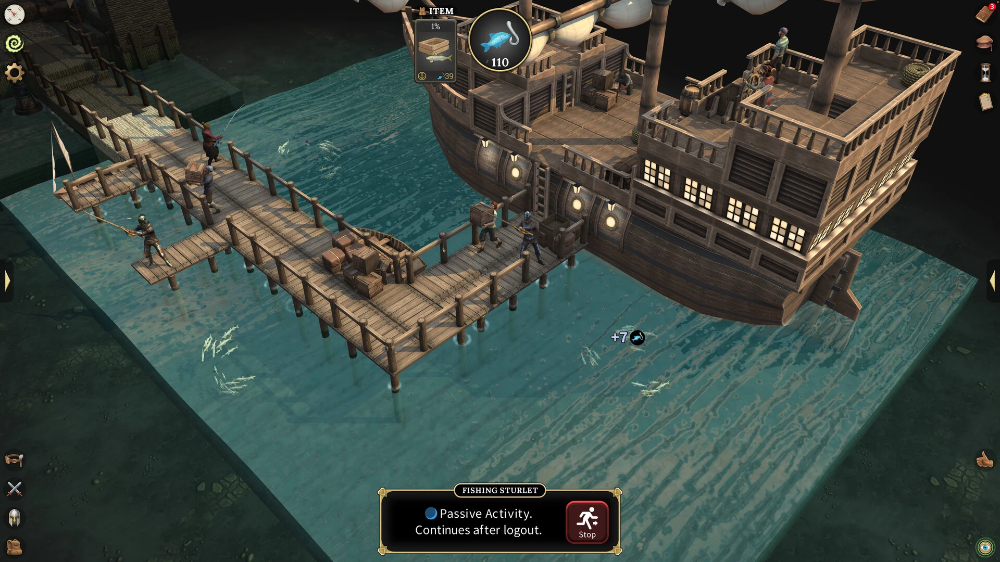
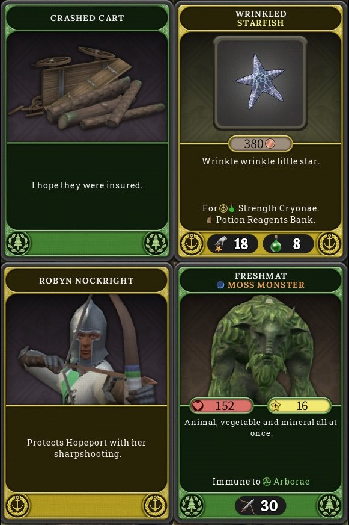
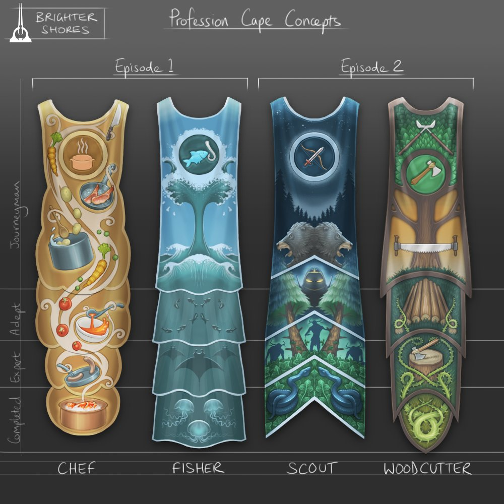

Here you can find all the latest information relating to Brighter Shores before the any pubic Alpha/Beta testing. I'll update this article as I find information.

Last Updated: April 29th, 2024

## Brighter Shores
Brighter Shores is an upcoming 2024 Q3 MMORPG by [Andrew Gower](https://twitter.com/AndrewCGower). If that name doesn't ring a bell for you, nothing is wrong with that. He is considered the father and maker of Runescape that Jagex currently owns.
For general information about Brighter Shores, I suggest you look at the [Steam Store](https://store.steampowered.com/app/2791440/Brighter_Shores/) page for the game. 

### It's Not Runescape
Many people who have seen previews of Brighter Shores love to compare it against Runescape as that is Andrew's predecessor. Yes, there are many similarities like the grid based tile and click movement. However the game will play much different than what you would expect out of Runescape. The first major difference is that there are 3 Factions/Classes that you can pick from and can't change; Cryoknight, Guardian or Hammermage.

## No Tick Manipulation
Runescape is known for it's server [tick manipulation](https://runescape.wiki/w/Tick_manipulation), however this is something Brighter Shores will *NOT* have. Andrew has clearly stated;
> movement is grid based, but the timing of the movement (and everything else) is NOT tick based so its very responsive.
> - Andrew Gower:[Twitter Post](https://x.com/AndrewCGower/status/1768001320500314149)

## Andrew Will Not Sell Brighter Shores
This information is very important to historical events around Runescape. After Andrew sold Runescape, it's been mentioned that Jagex has converted the game into a MTX machine.
> I have no intention of selling it. I can’t see what I would gain from doing so, as I already have enough money. This is a passion project which I want to keep.
> - Andrew Gower:[Twitter Post](https://x.com/AndrewCGower/status/1769638406391243078)

Anyone who has a passion and has the ability to pursue that passion generally yield great results. It's a labor of love, and because of this we can expect great things!

## MTX Be Gone
Microtransactions means many different things for gamers, but for Andrew they are a thing of the past! He *hates* MTX and due to this it's highly unlikely to see any MTX in Brighter Shores.
> I dont like mtx. So I am planning on making a huge chunk free and then selling an all-inclusive ‘premium pass’ to access the rest. The steam page has more info at the bottom.
> - Andrew Gower:[Twitter Post](https://x.com/AndrewCGower/status/1767972742349901919)

> There's just way too many microtransactions for my personal liking. I like to buy a game, or subscribe to a game or whatever, and then have everything. I don't want to be asked every five seconds or tempted every five seconds to fork over some more money. I just feel it detracts from the game. Our number one aim is not monetization, it's players
> - Andrew Gower:[gamesradar Interview](https://www.gamesradar.com/ahead-of-his-new-mmo-runescape-creator-says-games-have-gotten-too-microtransaction-heavy-our-number-one-aim-is-not-monetization-its-players/)

## Not Subscription Based
For some people this may come at a shock, but there are zero plans at a subscription model for Brighter Shores. As mentioned above; "I already have enough money." so there is no concern about corporate greed taking over. However this rises the question; what is the 'Premium Pass' that is mentioned around the game?
> You will have to keep buying the premium pass if you want to keep getting access to the paid content. But we feel that auto-recurring subscriptions are a very hard sell these days. Everyone's got their millions of different streaming service subscriptions, people are getting a certain degree of subscription fatigue. So we've decided to just make a non-recurring payment, you can just buy a pass, get premium one time. It's not a commitment that you're gonna have to pay that forever. It gives you access to absolutely everything we've released up to that date. But obviously, we expect that when we release new episodes, that will drive people to take out a premium pass to enjoy that new episode. And then we'll bring out another episode, and then they'll buy another premium pass to enjoy that season.
> - Andrew Gower: [gamesradar Interview](https://www.gamesradar.com/runescape-creator-answers-our-biggest-questions-about-his-new-mmo-brighter-shores-classes-professions-monetization-and-a-ttrpg-open-world/)

## Episodic in Nature
The main story for Brighter Shores will be released in episodes.
> Progress update: We are planning on launching our big game with 4 episodes to start with. The first 3 episodes are very playable now and just need a bit more testing/tuning. I am working on episode 4 now...
> - Andrew Gower: [Twitter Post](https://x.com/AndrewCGower/status/1725549202787258470)

> Each episode features its own unique side quests, professions and lands, as well as advancing the central story.
> - Public Source:[Steam Page](https://store.steampowered.com/app/2791440/Brighter_Shores/)

## Professions
There will be many different professions in game, however they will be linked to the episodes.
> We've tried to make the professions link into one another quite a bit. We've tried to mix it up a bit. Some of them are more standalone than others because we've tried to, again, have variety, depending on the mood you're in and how you want to play it. As you level up, we've tried to make the pace at which you get new things to do in the professions very rapid so it doesn't get too dry and too repetitive. 
> They're also linked to the episode structure we've got. So you don't get every single one straightaway. As you go through the game, more and more become available. You can do them all at once, but you have to progress through the story, because we don't want to overwhelm. 
> - Andrew Gower: [gamesradar Interview](https://www.gamesradar.com/runescape-creator-answers-our-biggest-questions-about-his-new-mmo-brighter-shores-classes-professions-monetization-and-a-ttrpg-open-world/)

In addition; there will be different ranks to the professions;
 * Journeyman
 * Adept
 * Expert
 * Complete
 > - Andrew Gower: [Twitter Post](https://twitter.com/AndrewCGower/status/1783863736056386029)

### Confirmed Professions
From the [Steam Store page](https://store.steampowered.com/app/2791440/Brighter_Shores/) we have the following confirmed professions;
- Fisher
- Forager
- Chef
- Woodcutter
- Miner
- Alchemist
- Stonemason
- Merchant
- Blacksmith
- 'and many more!'

### Possible Professions (Coming Soon)
Information coming soon on this matter. [Want to provide possible leads and not random nonsense.]

## The World
Brighter Shores will be an Open World, but a 'room based' system. [Andrew showcased a video on Twitter.](https://x.com/AndrewCGower/status/1776276857706479810) There are many questions fans are asking about the room system and how it will work. Thankful Andrew has been kind enough to share some insight on it! (See Discoveries section for video footage.)
> One of the unusual things about our world is we've gone with a room-based system which has the feeling of a lot of RPGs where your characters will be in a room doing a certain encounter, and then you're in another room doing an encounter. The rooms all connect together; it's very easy to move between one and the other. It has various technical advantages as well, because it lets us instance each room the right number of times based on how many players are in it, so we can make sure that no part of the world gets too crowded or too empty. There's a sweet spot of how crowded you want the game to be to feel nice, but too crowded and it feels just overwhelming and totally empty and it just feels a bit dead. 
> I'm very keen to cater to players who want to explore and discover. We've got this world map that shows you everywhere you've been but it starts off completely blank, just the room you're in. And each time you explore a new room, it maps it out for you onto the map. You can discover things in the room by clicking on them, and as you do it labels them on the map for you. So it does it all automatically. The first thing a lot of players will probably do is just walk around the world a bit mapping everything out by going to each different room, clicking on things in the room to see what's in them, and letting it put them on the map and just getting a feel for what is where. So you get this lovely feeling of exploration.
> - gamesradar News: [gamesradar Interview](https://www.gamesradar.com/runescape-creator-answers-our-biggest-questions-about-his-new-mmo-brighter-shores-classes-professions-monetization-and-a-ttrpg-open-world/)

> the number of players allowed in each room depends on the room, market place rooms are allow to get very crowded to aid trading, room with monsters allow less players at once so the monsters don’t get over contended, other rooms are between the two. If a room is full it automatically creates more instances of it to keep how crowded each instance is at the optimum level for the gameplay to work well. If you have a friend in a room it will try to put you in the same instance your friend is in.
> - Andrew Gower: [Twitter Post](https://x.com/AndrewCGower/status/1776290972768297098)

> when in combat the exits to the room become ‘locked’ so you cant leave the room during combat without using an immunity spell first. (which takes time to cast). This gives a really nice balance between being able to move around tactically during combat, whilst not being able to escape TOO easily.
> - Andrew Gower: [Twitter Post](https://x.com/AndrewCGower/status/1776291731970875479)

### Discoveries
As mentioned above, as you explore the world, the world map will be filled out for you. As part of this exploration there are interactions and 'Discoveries' for you to find in each room. By discovering objects and resources it will continue to fill out your world map with the information needed.

[Andrew Gower Video | Twitter Post](https://x.com/AndrewCGower/status/1791500208351658390)

## Botting
Are there any plans against bots?
> Yes, this is something I have considered at length. I have tried to design the game from the ground up such that bots shouldnt ruin the economy / game.
> - Andrew Gower: [Twitter Post](https://x.com/AndrewCGower/status/1767972268116787290)

> "Obviously, you're never going to completely eliminate bots," Andrew Gower told PCG in a recent interview, "so our approach has been more to make it so that they don't negatively impact the game." 
> - PCGamer News: [PCGamer Interview](https://www.pcgamer.com/games/mmo/runescape-creators-new-mmo-has-an-unorthodox-solution-for-the-inevitable-waves-of-bots-giving-you-a-legitimate-way-to-bot-the-game-yourself/)

### Offline Skilling
Part of Andrew's vision for removing bots and removing the grind is enabling the players to play while offline. Keep skilling while you are not logged into the game. While this concept isn't new in the gaming industry (IdleMMO and other mobile games have this), it will be one of the first major MMOs that will include it. 
> Gower says one of the ways Brighter Shores is trying to minimize "grindy gameplay" is with a feature that lets you "set your character to carry on doing [activities] even whilst you're logged out." That means you shouldn't have to spend "hours and hours and hours to get your level up." Instead, you can set your character to get on with the grind while you're away. "You might be doing combat while every night [your character] is doing fishing," or vice versa.
> - PCGamer News: [PCGamer Interview](https://www.pcgamer.com/games/mmo/runescape-creators-new-mmo-has-an-unorthodox-solution-for-the-inevitable-waves-of-bots-giving-you-a-legitimate-way-to-bot-the-game-yourself/)

## Combat Classes
There are currently 3 planned classes for the player along with 3 character slots. In short you will be able to play one of each class! Additionally each class will have the ability to be range/melee/magic type with their class. 
>  I wanted people to have a reason to have more than one character. It's always nice to have different characters. And all three characters can do magic. That's one thing I should probably mention. So it's not like one is magic and one isn't magic; they've got different types of magic. So the Cryoknights have got ice magic, the Guardians have got nature magic, and the Hammer Mages have got sort of storm magic. They can all do range, they can all do melee. But I did want you to have to make a decision. You don't have to make it at the very beginning, because personally I hate it when you start playing a game and the very first thing they ask you is an absolutely critical decision, when you have absolutely no idea how you're going to make it. Here you start off as a guard and you actually make your way into the game before you have to choose your character class.
> - Andrew Gower: [gamesradar Interview](https://www.gamesradar.com/runescape-creator-answers-our-biggest-questions-about-his-new-mmo-brighter-shores-classes-professions-monetization-and-a-ttrpg-open-world/)

## Game Currency
There will be Copper, Silver, and Gold with no other currencies planned at this time.
> there isnt multiple currencies. There is 1000 copper to a silver, and 1000 silver to a gold.
> - Andrew Gower: [Twitter Post](https://x.com/AndrewCGower/status/1771788649589289317)

## Alpha|Beta Information
There are no known plans for a public Alpha/Beta at this time. However there are plans for a Closed Beta.
> There will be a closed beta. I will post more about it on x/twitter closer to the time.
> - Andrew Gower: [Twitter Post](https://x.com/AndrewCGower/status/1767973447425003776)

## Information Cards
Paul Gower is another source of information and he has been working on the Information Cards of Brighter Shores. Information internally to the game will be shared by using these Information Cards so you can gain a better understanding of the game while playing. Make sure to interact with everything so that you can collect these cards!

> Today I have been mostly describing stuff. Virtually everything in Brighter Shores has these information cards. There are thousands of them and they all have description text boxes.
> - Paul Gower: [Twitter Post](https://x.com/PaulJGower/status/1781334642265559394)

> They’re mostly shown as a result of examining something so that we can also give some statistical information, and they also fit in with our tabletop gaming aesthetic. If they’re profession features, they also get collected into the professions interface for completionists.
> - Paul Gower: [Twitter Post](https://x.com/PaulJGower/status/1781360187804164590) 

## Capes
It has been confirmed that Brighter Shores will have capes for your achievements! The Profession capes will 'grow' as your progress your skill.
> This week, our artist Greg has been designing the "profession capes." Each cape has 4 sections, which are progressively unlocked as you level up. The final cape section is only for players who reach the top level. Here are some of our favorites.
> - Andrew Gower: [Twitter Post](https://x.com/AndrewCGower/status/1783863736056386029)

