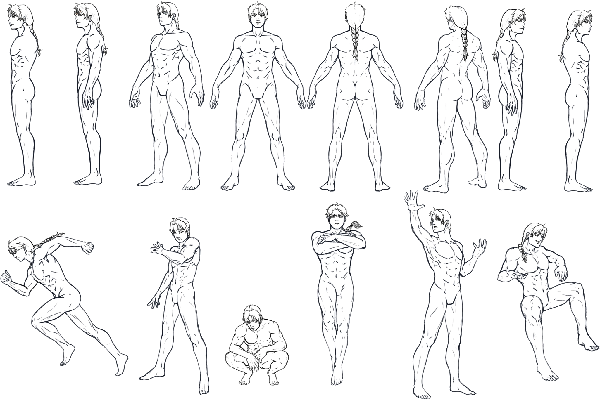
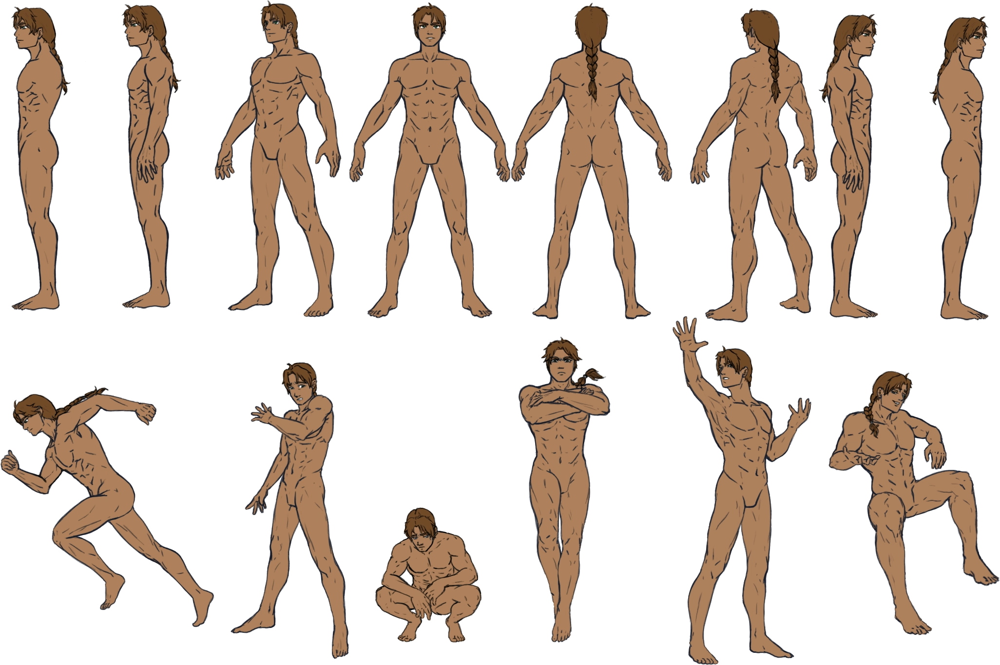
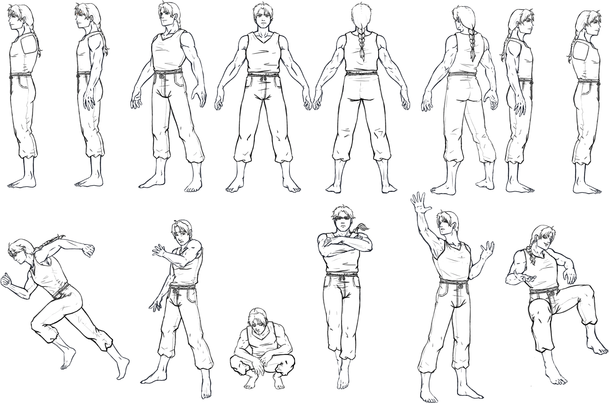
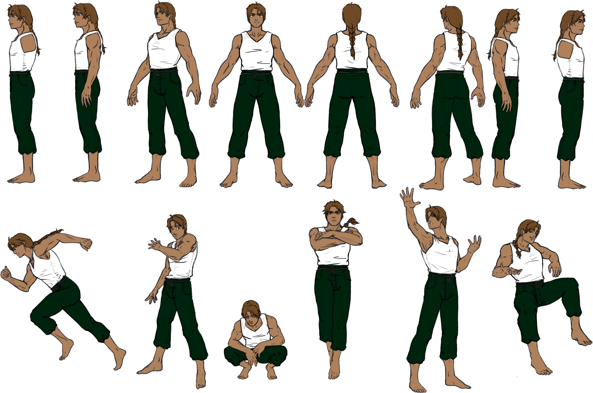
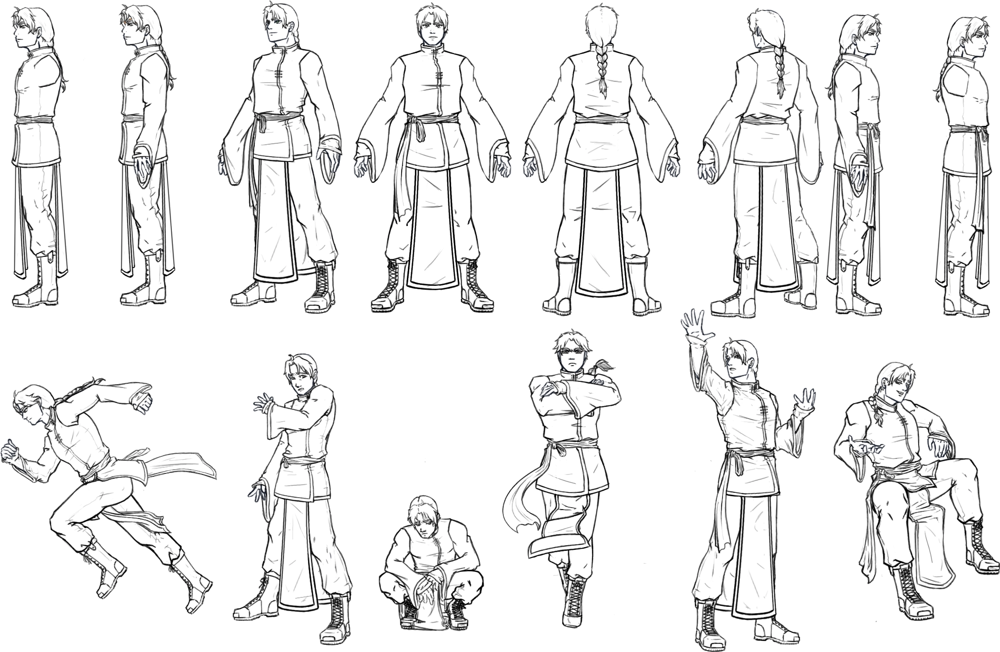
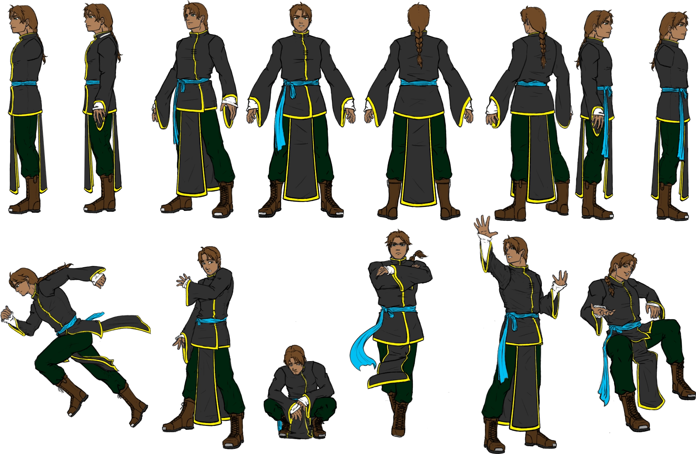
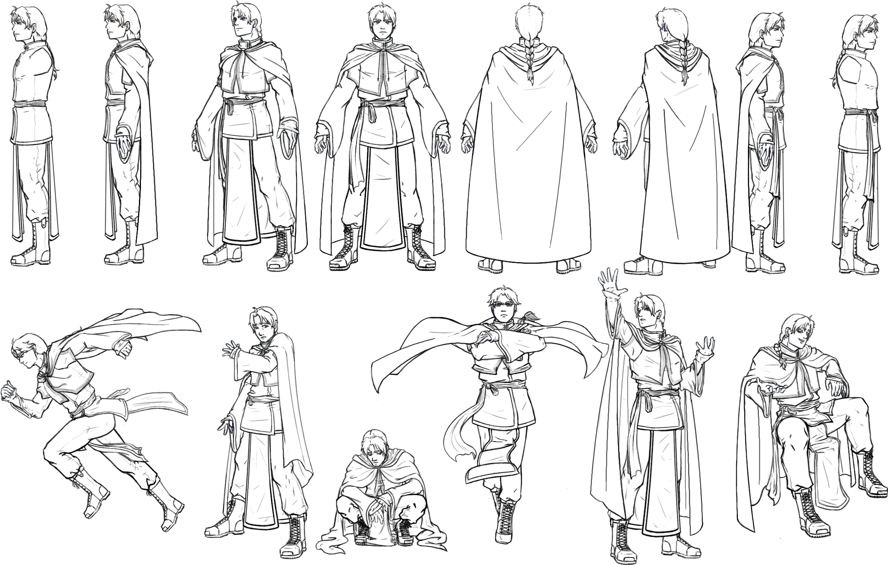
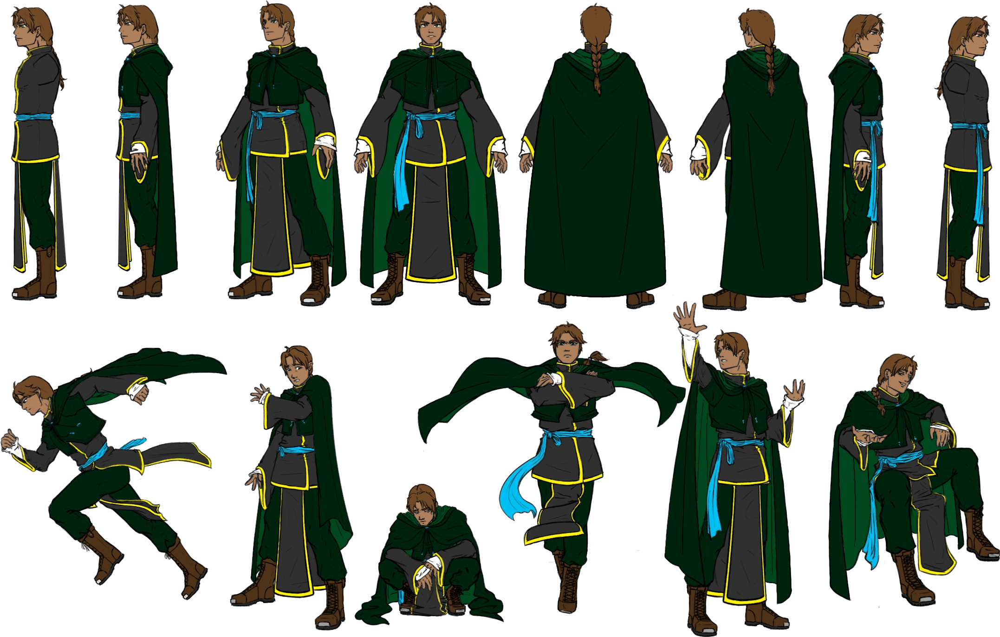
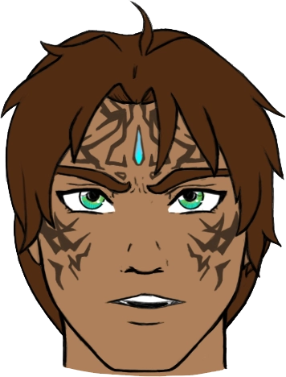
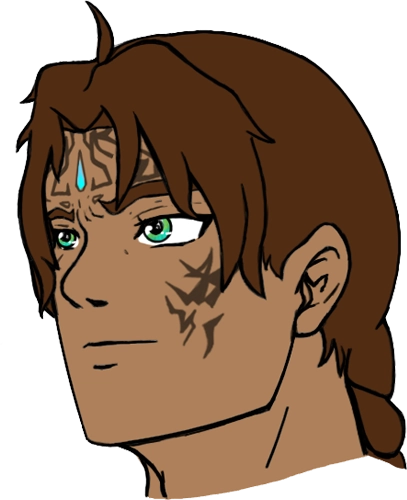

## Reference Mala Zedik
My friend [Aerpenium](https://www.deviantart.com/aerpenium) did all the artwork for Reference Mala Zedik. They never cease to amaze me with the artwork they can create!

This is as it states, a reference sheet that I had Aerpenium make for Mala Zedik. I wasn't worried about the detail specifics showing on this sheet (Like height and weight). I mostly wanted it to show off all the common expressions and movements of Mala Zedik. A way to help better bring him to life in a sense.

I do want to explicitly state that I am not interested in any NSFW work for Mala Zedik, so the images of him would never fall into that category. All images are Mala Zedik fall into the SFW category and are intended to show body structure.

### Naked Outline

### Naked Colored

### Basic Clothing Outline

### Basic Clothing Colored

### Partial Clothing Outline

### Partial Clothing Colored

### Full Clothing Outline

### Full Clothing Colored

### Forward Facing

### Quarter Facing

## White Glow / Outline
Yes, I am aware of the white glow/outline in the images above. I have better versions of the files somewhere... But in order to save drive space on the website, I've taken a few shortcuts. So, to show off the images it will have to be this way. Sorry! I may fix it in the future for the website, but for now, please don't mind it.

