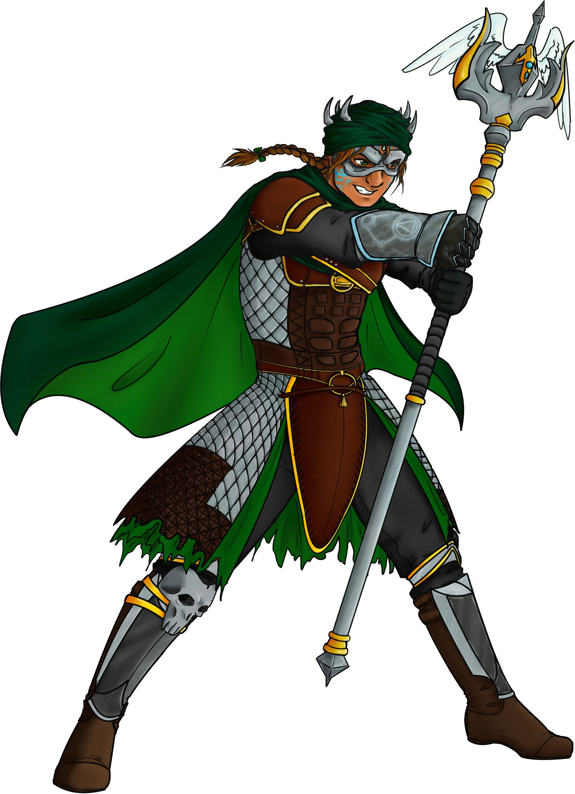

## New World Mala Zedik
My friend [Aerpenium](https://www.deviantart.com/aerpenium) did all the artwork for this New World Mala Zedik. Sadly this will be the last of their work as they've informed me they will no longer be drawing art anymore. 

New Worl Mala Zedik, as it sounds, is a version of Mala Zeidk with New World influences. I'm intending this to be my profile image for a while playing New World. If you look closely, you can tell the two different weapons I intend to focus on for Mala Zedik, Ice Gauntlet and Life Staff.

## Life Staff
In this image, I have Rafa merged with a Life Staff that can be found in New World. I felt it was a good touch to merge the two into one item for this artwork.

## Ice Gauntlet
I figured the Ice Gauntlet would be a nice weapon to pair with the Life Staff. So, if you look closely at the right arm of Mala Zedik, you can see the outline of an ice gauntlet there. While I don't think it's the ideal weapon combo for New World, I felt it was a good combo for the image. 
