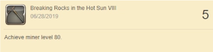

### Shurma Raha of Goblin

At 9:22.22am PST on June 28th, 2019, a new world record was made!
It is with great pleasure that I announce World's First 80 Miner! There are a few different ways I can state this record;
* World First 80 Miner
* NA Servers First 80 Character
* World Second 80 Character

To be clear a [Japanese player obtained World's First 80 Culinarian](https://twitter.com/higejori/status/1144574255822016512/) before I was an 80 miner. Kudos to them for finding the Leve quest in town in which they could buy all the materials and cook the items for the Leve! (It *really* was a smart move.)

### Verifying World First

I posted a thread on [FFXIV's Subreddit](https://www.reddit.com/r/ffxiv/comments/c6m9u6/world_first_80_miner/) to see if anyone else had reached level 80. Shortly after that post, [/u/x3_Starlight](https://www.reddit.com/r/ffxiv/comments/c6m9u6/world_first_80_miner/es9p5qm/) was kind enough to share the tweet for the world's first 80 Culinarian. 

There were no other posts or mentions of other players reaching level 80 on June 28, 2019, that were publically posted. If you think you might have reached level 80 on the first day, you can check your achievements to see what day you reached 80. Similar to mine below;

### How it was done
I'm pleased to say that I didn't skip any cut scenes and listened to all the voice lines in the process of doing this. I played the main story content until I reached Amh Araeng and started mining away! After many hours and reaching level 75, I switched things up.

I went back to the Crysatrium and started to work on the Leve Quests to finish the last 5 levels to reach level 80. That's really it in a nutshell. I streamed the last hour of the grind as I felt confident at that point to share what I was doing with the world.

