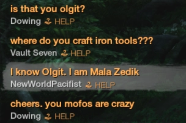
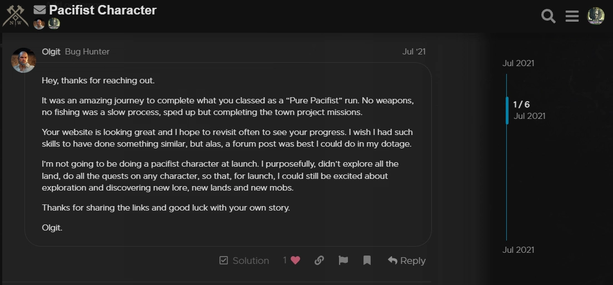

## NewWorldPacifist

At 8:11 pm PST on August 1st, 2021, a new world record was made!
It is with great pleasure that I announce World's First 60 Pacifists on public servers!

In short; I was able to reach level 60 without killing anything. It took a total of 3 Days, 20 Hours, and 51 Minutes in-game time. Which was about 12 days of constant grinding for me. 

I do want to be clear, that I was the first person to 'publically' complete this challenge for New World. Olgit was the first player to reach level cap as a Pacifist, however, it was done in the Alpha where information was very limited and under NDA. Additionally, while the "Closed Beta" was considered closed, players could request access via Steam and gain access, instantly, to the beta without paying. 

### Olgit

If you are not familiar with who Olgit is, they are the first person to complete the Pacifist challenge in New World, but on the Alpha Servers. As stated previously, Alpha is under NDA and information from it is very limited.

What I can share, however, is small snippets that elude to the fact that Olgit completed a pacifist challenge in the Alpha. (See below)

As for the website Olgit is mentioning, it is [www.NewWorldPacifist.com](https://www.newworldpacifist.com/) which is a website I created for New World.

## Challenge Runs

There are many different ways you can play a game based on the mechanics. For example, it's possible to complete the Final Fantasy I game with only 4 White Mages. It is far from ideal group make-up, but it adds a challenge for those who want one in their favorite game.

The idea of any challenge is to limit the player's capabilities to challenge their skills for the game. That's how/why this achievement of a world-first pacifist character came into being.

## Verifying World First

For a Pacifist Character in New World, their achievements page would need to be displayed upon reaching level 60 to show they didn't kill anything.

As for verifying it against other players, there were no public mentions of anyone else completing this challenge for the New World Beta event. 

I've [uploaded a video](https://youtu.be/AHV8DXOpA_c) of me reaching level 60 and displaying all my achievements for verification if anyone wanted to contest it.

## How it was done
I have a day-by-day breakdown of the events as they occurred for those interested in how. See below!

### Week 1 Results
The first week of closed beta was hectic! I ended up at level 36 with 35 hours played. On top of all this, my leveling method was nerfed in a hot-fix Friday morning. Town Board Quests used to refresh every 5 minutes but was changed to a 30-minute refresh timer.

#### Day 1 (Tuesday)
All about gathering resources and getting myself upgraded to the best tools I could get. Iron is minable at level 1, so I was able to get a full set of Iron Tools. Gear on the other hand was a bit too RNG for me to try and get a solid set going. End of the day I hit level 19 due to all the Town Board quests I was able to complete. For the Town Board Quests I did my best to have a mix of raw resources and refined resources in the Storage Shed.

#### Day 2 (Wednesday)
A bit of a short day for me as I had to drive 6 hours that day. The focus for the day was to try and get gathering gear for all but skinning. I didn't want to have a skinning-focused set of gear because it's not an easy profession to focus on as a pacifist. This would also save me a little bag space. Most of the gear I ended up buying off the Trading Post for ok prices. Overall I would say it was a success as I was able to get 4/5 of my armor with bonus luck-gathering perks. By the end of the day, I was able to achieve level 23.

#### Day 3 (Thursday)
The day's focus was set for levels! Try to see how far I could level in one day. I ended on level 35 for a total of 12 levels. Not as big as my first day, however at higher levels more experience is needed to level. Overall more experience which means I feel it was successful when compared to Day 1.

#### Day 4 (Friday)
Just play the game day. I just wanted to relax and try different things this day. There was a push for Starmetal tools but was unable to achieve that due to my Engineering level, not 100. Admittingly the Town Board Quest nerf bummed me out some cause I don't think I will be able to hit level 60 before the end of Closed Beta now. Still happy that pacifist characters are a thing though!

### Week 2 Results
The second week of Closed Beta seemed just as crazy as the first week. Amazon Game Studios has a bit on its hands with server stability. In the end, though I was able to reach level 60! 3 Days, 20 Hours, and 51 Minutes in gameplay time to achieve this. 

#### Day 5 (Monday)
My focus was leveling as I was able to see level 60 in range before the end of the Closed Beta still. I also made this my Exploit Awareness Day for the stream. I showed off the town board reset quest exploit upon request to show that it is still active in the game and to provide the devs with more information about the bug. Since I was not doing the gathering 0 turn-in exploit, the only thing this exploit did was enable me to level faster with the extra resources I had. (~3 hours faster based on how many times I did it) Went from level 36 to level 42. I did play for about 12 hours this day...

#### Day 6 (Tuesday)
Went back to grinding to get that sweet level 60. Obtained level 47 after a 10-hour play session. Decided to make the change from Windsward to Everfall for my questing hub. Everfall had 3 more quests for me to pick from since they were using all the upgrades they had access to while Windsward wouldn't do the quality-of-life upgrades. I also decided to test out Luck gear over the gathering luck gear to see if there was much of a difference. From a gathering view, it doesn't appear to affect it so you will want gathering luck based on what you are gathering. 

#### Day 7 (Wednesday)
One of my shorter 4-hour days. Reached level 49. Put some more thought into the gathering luck and I feel that the Harvesting luck is the only one worth doing while leveling. Created a spreadsheet for crafting and item sources for the community. Harvesting things like Herbs with harvesting luck tends to yield more cooking ingredients than not. If you plan to open a lot of crates though, I strongly suggest luck to gear for that. Moved to Weaver's Fen to test experience rates over there and to not support the mega-company on the server.

#### Day 8 (Thursday)
Spend a little under 11 hours playing this day. Ended on level 54. Amazon Game Studios patched the Town Board quests. The repeated turn-in is no longer and on top of this they adjusted the experience rates. I was worried that they would be nerfed, but they seem better since I was able to level faster than before. It could be anecdotal since I can see the end in sight, but I'll know for sure after I review past videos when I get a chance. Started to _really_ feel the stress of playing the game for extended periods so I disabled my mic for the day. Moved over to Mourningdale for better experience rates since the mega company was willing to do upgrades over there for me. With the patch, the higher level zones gave more experience than lower for crate gathering. 

#### Day 9 (Friday)
Streamed for a total of 8 hours and reached level 57. Decided to keep my mic off to help me keep my sanity. My introverted side was starting to take over. I was defiantly focused on reaching the end goal. Tested zone jumping to increase my xp rates for leveling. Seems to of done me good. 

#### Day 10 (Sunday)
With only 3 levels remaining, I decided to take a break Saturday. Seems I needed just another 6 hours from the last time I played to reach level 60. The break helped me focus and enabled me to do town boards from multiple locations. I jumped from Mourningdale/Windsward/Everfall to complete quests at a faster rate.
