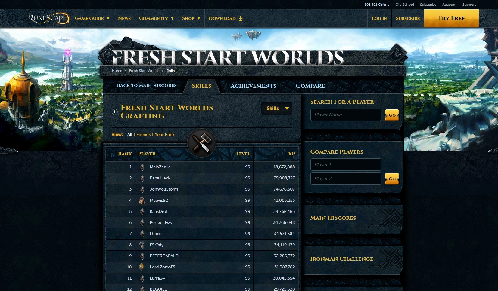

## MalaZedik on Fresh Start Worlds
At 2:16 pm PST on November 6th, 2022, a new world record was made!
It is with great pleasure that I announce World's First 120 Crafter on Fresh Start Worlds!

## Verifying World First
Runescape created a method to let the world know who was world-first on the Fresh Start Worlds. A broadcast in-game would go out saying "News: On Fresh Start Worlds, USERNAME is the first player to reach level XX SKILL." For me, it would have been "News: On Fresh Start Worlds, MalaZedik is the first player to reach level 120 Crafting." However, Jagex being Jagex had a glitch in the game preventing the Broadcast when assisting a player for experience gain. 

The community also took notice that I wasn't the player that was awarded the 120 broadcast and [created a reddit post](https://www.reddit.com/r/runescape/comments/yzwk9z/papa_hack_is_not_the_worlds_first_despite_getting/) about the glitch.

[Knowing I was going into World First 120, I also recorded a video and uploaded it to YouTube.](https://www.youtube.com/watch?v=HlJKcfNBo7o)

### HiScores
Runescape hosts a section on its website dedicated to [HiScores](https://secure.runescape.com/m=hiscore/ranking) for players of RuneScape. As such, [Fresh Start Worlds](https://secure.runescape.com/m=hiscore_seasonal/snapshot) has its own HiScores page. HiScores are updated when a player logs out of the game and a player can't stay logged in longer than 24 hours. So, in a sense, the HiScores are updated every 24 hours.

I ended up taking a screen capture of the crafting leaderboards a few days after I reached 120 to show it as evidence in verifying world-first 120.

### Runescape Wiki
Players around the world were also keeping an eye open for world firsts and recording them on the [Fresh Start Worlds page on the Runescape Wiki](https://runescape.wiki/w/Fresh_Start_Worlds). Anytime a Broadcast occurred, a few players would update the wiki with the appropriate information. In addition to this, players were cross-referencing the HiScores board with the information so that it would stay accurate. 

As such, my name ended up on the Wiki page as the World First 120 Crafter with the date of November 6th! 

### Challenger Halo
As part of the broadcasting system that Jagex used for Fresh Start Worlds World Firsts, the [Challenger Halos](https://runescape.wiki/w/Challenger_halo) were awarded to players who had the broadcast. While I am the world's first 120 crafter on fresh start worlds, I was never awarded the Challenger Halo via the Global Broadcast due to the Assist Glitch. (Jagex did award me with the Halo later.)

## How it was done
I ran 4 clients of Runescape, each with different characters so that I could gather enough resources for crafting experience. So I was multi-boxing 4 characters, 3 of them were gathering gems at the [Al Kharid Mines](https://runescape.wiki/w/Uncommon_gem_rock) and MalaZedik would be completing any quests or activities I wanted to at the time. On the 3rd day, I worked on getting all characters a [Gem Bag](https://runescape.wiki/w/Gem_bag) for better gem-gathering rates. In addition, I created [Ring of Duelling](https://runescape.wiki/w/Uncut_dragonstone) for faster returning to the Gem Rocks for gathering.

Unlocking [Prifddinas](https://runescape.wiki/w/Prifddinas) was my primary goal to start as it would give me access to the [Crystal Chest](https://runescape.wiki/w/Crystal_chest) which would give me [Uncut Dragonstone](https://runescape.wiki/w/Uncut_dragonstone) for high crafting experience rates. I took this approach because experience rates would increase throughout the event, making the Dragonstones the best experience per hour in the future.

Most of the gems cut were vendor sold for gold to purchase more uncut gems from the GE. I did buy a decent chunk of Uncut Dragonstones from the GE near the end to hasten the process as money on Fresh Start Worlds meant nothing to me. To further support the process of buying gems, I transitioned 2 of my gem collectors to Rune Dart smiths. This was highly profitable as Rune Dart Tips sold upwards of 1000 ea during the peak of the bonus experience. 

### Burthorpe Crafting Stations
Burthorpe was the major hub for Fresh Start Worlds as that was where the Challenger's Ring would teleport you instantly and there was a bank located there. As such, players set up all the crafting stations in Burthorpe.

During this process, I was mostly located on World 211 East Coast as that is where a majority of the player base was using the limited crafting stations. Even though I am more of a West Coast player, the bonus experience and the chance to save a gem outweighed the 0.25 lag I was occurring after each cutting of gems in my bag. 