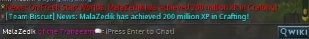

## MalaZedik on Fresh Start Worlds
At 10:09 pm PST on November 19th, 2022, a new world record was made!
It is with great pleasure that I announce World's First 200 Crafter on Fresh Start Worlds!

Update: [World Only - No other player achieved 200m experience during Fresh Start Worlds.](https://secure.runescape.com/m=hiscore_seasonal/snapshot?category_type=0&table=13&page=1)

## Verifying World First
Runescape created a method to let the world know who was world-first on the Fresh Start Worlds. A broadcast in-game would go out saying "News: On Fresh Start Worlds, USERNAME is the first player to reach level XX SKILL." 

[Knowing I was going into World First 200, I also recorded a video and uploaded it to YouTube.](https://youtu.be/8XTzgJpleFc)

### HiScores
Runescape hosts a section on its website dedicated to [HiScores](https://secure.runescape.com/m=hiscore/ranking) for players of RuneScape. As such, [Fresh Start Worlds](https://secure.runescape.com/m=hiscore_seasonal/snapshot) has its own HiScores page. HiScores are updated when a player logs out of the game and a player can't stay logged in longer than 24 hours. So, in a sense, the HiScores are updated every 24 hours.

Update: The HiScores website has me as the only player with 200m experience!

### Runescape Wiki
Players around the world were also keeping an eye open for world firsts and recording them on the [Fresh Start Worlds page on the Runescape Wiki](https://runescape.wiki/w/Fresh_Start_Worlds). Anytime a Broadcast occurred, a few players would update the wiki with the appropriate information. In addition to this, players were cross-referencing the HiScores board with the information so that it would stay accurate. 

As such, my name ended up on the Wiki page as the World First 200 Crafter with the date of November 19th! 

## How it was done
Please see the [Runescape 120](/world-records/runescape-120/) section for this information. The tl;dr version is cutting gems. 