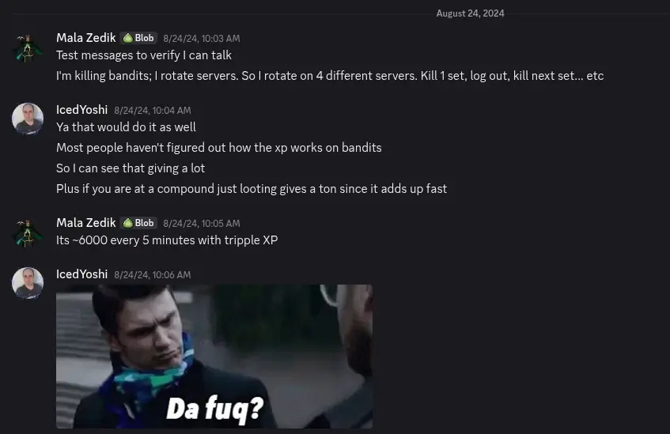

## XERA: Survival 
XERA: Survival is a niche game, so don't worry if you have never heard of it before. It's a survival game with public only servers and is a PvPvE focused game. Machines roam the lands and will attack players on site. Players can be friendly or kill on sight (Most players play KoS). Most servers are PvP focused, but each region has 1 PvE server for those who would like to build more than anything else. 

If you are familiar with SCUM, I would say that XERA is SCUM-lite. You can build a base. Sell items to NPCs. Transfer items between servers via stash. There are (static) events that happen over that map. Bandits that can attack you and much more. 

## Season 7
XERA: Survival runs different seasons based upon the game development. Due to this, it is unknown the length a season can be, so it can be challenging not knowing how long you might have to play to hold your position on the leaderboards. Season 7 started on May 28th, 2024 and ended on December 19th, 2024. Meaning Season 7 lasted about 7 months. For additional context, Season 6 lasted 1 year. 

## How was it done?
With the addition of Season 7, there were bandits added to islands on the coast. These bandits give 100xp per kill and respawn rather quickly when you jump between servers. Using this method, I am able to get to complete a season pass in 2 days, which means I reached level 100 in less than 48 hours. 

I reached out to the community manager about it to make sure it wasn't considered an exploit or a cheat. They didn't want to change it for Season 7, however IcedYoshi stated he would talk to Joshua about maybe changing it in the future. See the image for the short conversation about it:

## Closing Notes
Oh boy... Don't try to juggle two different world records at the same time. Between this and Brighter Shores, I definitely burnt myself out. It's also caused my video game development to be put on the back-burner, which I have mixed feelings about doing as well.  